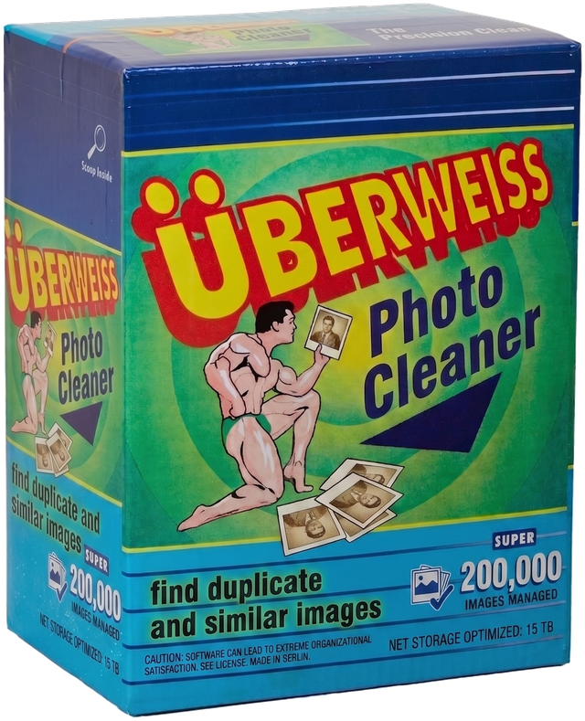

# Überweiss Photo Cleaner
## It's new, it's German, it's extra-tough.
<p align="center">
  
</p>

App to review **exact** and **similar** duplicates in a photo folder.


A small web server binds to `127.0.0.1` and opens a three-tab UI:

| Tab | What it shows | Deleting |
|-----|----------------|----------|
| **Exact** | Byte-identical files (SHA-256), including movies | Suggested copies are safe after a glance |
| **Similar** | Visually similar stills, including screenshots that match a camera photo | Opt-in. Tight same-timestamp extras can be selected as “likely” |
| **Other** | Screenshot/other stills similar to each other, plus a grid of ungrouped non-photos | Opt-in |

Movies are only considered on **Exact**. Live Photo companion `.MOV` files (same stem as a still in the same folder) are tagged `live_video` and kept off the Other tab.

## Requirements

- Python 3.10+
- macOS recommended (HEIC thumbnails via `sips`, Trash on external volumes)
- [`exiftool`](https://exiftool.org/) optional but useful (`brew install exiftool`) — camera vs screenshot classification

## Install

```bash
cd uberweiss-photo-cleaner
python3 -m venv .venv
source .venv/bin/activate
pip install -e .
```

## Run

```bash
photo-cleaner --root "/Volumes/Twenty/Pictures"
```

Or:

```bash
python3 -m photo_cleaner --root "/Volumes/Twenty/Pictures"
```

Then use the browser UI (default [http://127.0.0.1:8765/](http://127.0.0.1:8765/)).

```bash
photo-cleaner --root "/path/to/folder" --port 8765 --threshold 8 --no-browser
```

| Flag | Default | Meaning |
|------|---------|---------|
| `--root` | `/Volumes/Twenty/Pictures` | Directory to scan (recursive; skips `._*` caches, trash, Photos libraries) |
| `--host` | `127.0.0.1` | Bind address (keep this loopback unless you intend LAN access) |
| `--port` | `8765` | Port (a free port is chosen if this one is taken) |
| `--threshold` | `8` | Perceptual-hash Hamming distance for Similar/Other (0–32) |
| `--cache-dir` | `<root>/_photo_cleaner` | SQLite index + JPEG thumbs |
| `--no-browser` | off | Do not open a browser window |

Stop with Ctrl+C.

## Workflow

1. Wait until **Exact** shows a count (SHA-256). Review keepers, or **Select suggested copies**, then **Move to Trash**.
2. Wait until **Similar** is ready (thumbnails + perceptual hashes). Check extras you do not want. Screenshots of the same picture show up here next to the photo, with badges.
3. Use **Other** for screenshot dumps and non-camera stills. Filter the ungrouped grid if you want to thin screenshots that are not similar to anything.

Nothing is deleted until you confirm in the dialog. Files go to **Trash**, including on external volumes (`/Volumes/…/.Trashes`).

**Finder** on a card reveals the original in Finder.

## How matching works

- **Exact:** group by size, then SHA-256. Keeper prefers fewer `copy` / `(1)` / `__2` markers, shallower path, shorter name, older mtime.
- **Similar:** JPEG thumbnail, then a perceptual hash. Groups that contain at least one camera photo land on Similar (so a screenshot can sit next to the photo). Groups with only screenshots/other stills land on Other.
- **Class:** camera `Make`/`Model` + shot time → photo; filename `Screenshot` / `Screen Shot` / iOS `IMG_1234.PNG` → screenshot; remaining stills → other.

The folder `_photo_cleaner` is skipped on later scans. Delete it to rebuild the index.

## Tests

```bash
python3 -m unittest discover -s tests -v
```
